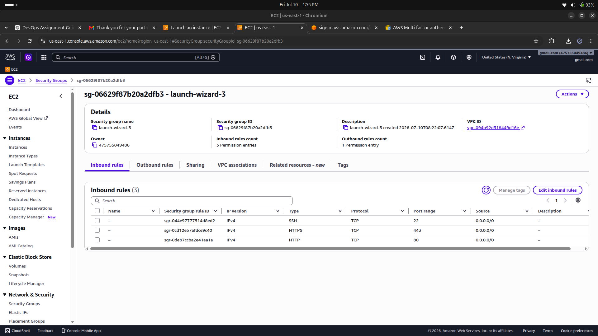
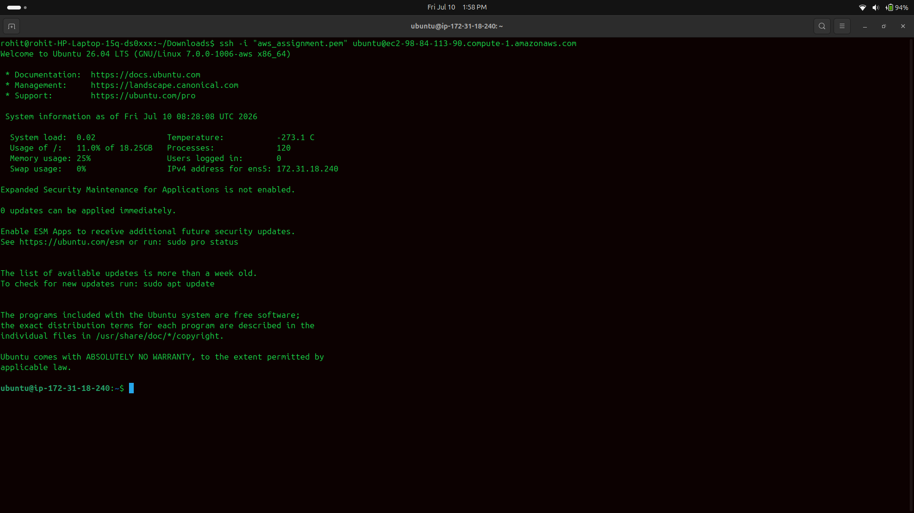
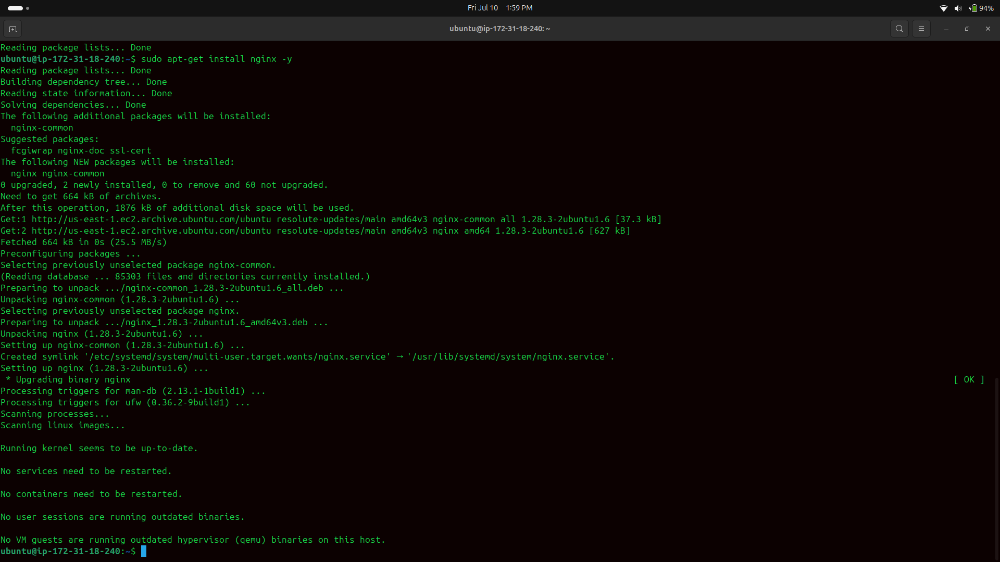
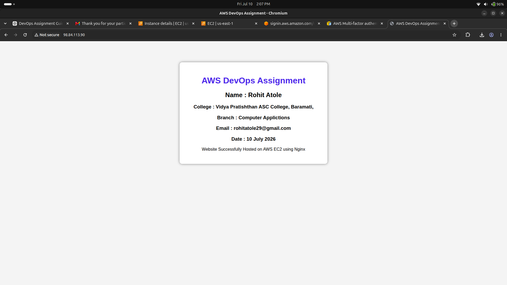

# 🚀 AWS DevOps Engineer Intern Assignment

> Deploying a Static Website on AWS EC2 using Ubuntu & Nginx


---

# 📖 Project Overview

This project demonstrates the deployment of a **Static HTML Website** on an **AWS EC2 Ubuntu Instance** using **Nginx Web Server**.

The objective was to understand the complete deployment lifecycle including:

- AWS EC2
- Security Groups
- SSH Access
- Linux Administration
- Nginx Installation
- Website Deployment
- Git & GitHub
- Documentation

---

# 🎯 Objective

Deploy a static HTML website on an AWS EC2 Ubuntu server using Nginx and document every step.

---

# 🛠 Tech Stack

| Technology | Purpose |
|------------|----------|
| AWS EC2 | Cloud Virtual Machine |
| Ubuntu 24.04 LTS | Operating System |
| Linux | Server Administration |
| Nginx | Web Server |
| HTML5 | Static Website |
| Git | Version Control |
| GitHub | Source Code Hosting |

---

# 📁 Project Structure

```
AWS-DEVOPS-ASSIGNMENT
│
├── index.html
├── README.md
├── AWS_DevOps_Assignment_Report_Rohit_Atole.pdf
│
└── Screenshots
      ├── aws_dashboard.png
      ├── Sg.png
      ├── ssh.png
      ├── install docker.png
      ├── nginx.png
      └── wbsite.png
```

---

# ☁ AWS EC2 Configuration

| Setting | Value |
|----------|-------|
| Operating System | Ubuntu 24.04 LTS |
| Instance Type | t2.micro |
| Authentication | SSH Key Pair (.pem) |
| Web Server | Nginx |

---

# 🔐 Security Group

| Port | Protocol | Description |
|------|----------|-------------|
| 22 | SSH | Remote Login |
| 80 | HTTP | Website Access |

---

# 💻 Connect to EC2

```bash
chmod 400 devops-key.pem

ssh -i devops-key.pem ubuntu@YOUR_PUBLIC_IP
```

---

# 🐧 Linux Commands Used

## Update Packages

```bash
sudo apt update
sudo apt upgrade -y
```

## Install Nginx

```bash
sudo apt install nginx -y
```

## Check Nginx Status

```bash
sudo systemctl status nginx
```

## Restart Nginx

```bash
sudo systemctl restart nginx
```

## Enable Nginx

```bash
sudo systemctl enable nginx
```

## Disk Usage

```bash
df -h
```

## Memory Usage

```bash
free -h
```

## Running Processes

```bash
top
```

---

# 🌐 Website Deployment

Replace the default Nginx page:

```bash
sudo nano /var/www/html/index.html
```

Restart Nginx:

```bash
sudo systemctl restart nginx
```

Open the website in your browser:

```
http://EC2_PUBLIC_IP
```

---

# 📸 Project Screenshots

## AWS Dashboard


---

## Security Group



---

## SSH Login



---

## Docker Installation (Bonus)


---

## Nginx Running



---

## Website Output



---

# 📚 Git Commands

```bash
git init

git add .

git commit -m "Initial Commit"

git branch -M main

git remote add origin https://github.com/rohitatole29/AWS-DevOps-Assignment.git

git push -u origin main
```

---

# 📄 Assignment Deliverables

- ✅ EC2 Instance Created
- ✅ Security Group Configured
- ✅ SSH Connection Established
- ✅ Nginx Installed
- ✅ Static Website Hosted
- ✅ GitHub Repository Created
- ✅ Documentation Prepared
- ✅ Bonus: Docker Installed

---

# ⚠ Challenges Faced

- Configuring Security Group rules.
- Setting correct SSH key permissions.
- Ensuring Nginx was running and accessible through Port 80.
- Managing Linux commands and file permissions.

---

# 📖 Key Learnings

- Launching and configuring AWS EC2 instances.
- Connecting securely using SSH.
- Installing and managing Nginx.
- Hosting a static website on Linux.
- Using Git and GitHub for version control.
- Understanding basic DevOps deployment workflow.

---

# 👨‍💻 Author

**Rohit Atole**

**Role:** DevOps Engineer

- GitHub: https://github.com/rohitatole29
- LinkedIn: https://www.linkedin.com/in/rohitatole1021

---

# ⭐ Project Status

| Task | Status |
|------|--------|
| AWS EC2 | ✅ Completed |
| SSH Connection | ✅ Completed |
| Linux Commands | ✅ Completed |
| Nginx Installation | ✅ Completed |
| Website Hosting | ✅ Completed |
| GitHub Repository | ✅ Completed |
| Documentation | ✅ Completed |
| Bonus (Docker) | ✅ Completed |

---

## ⭐ If you found this project helpful, consider giving it a star on GitHub!
